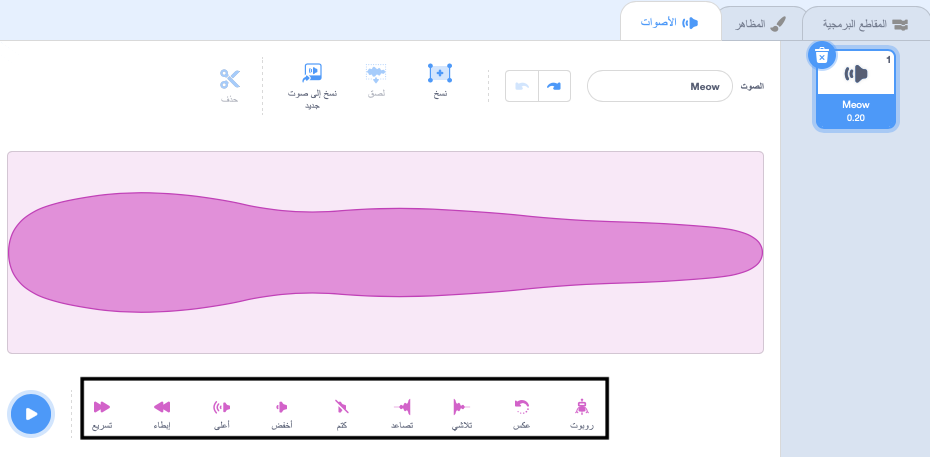
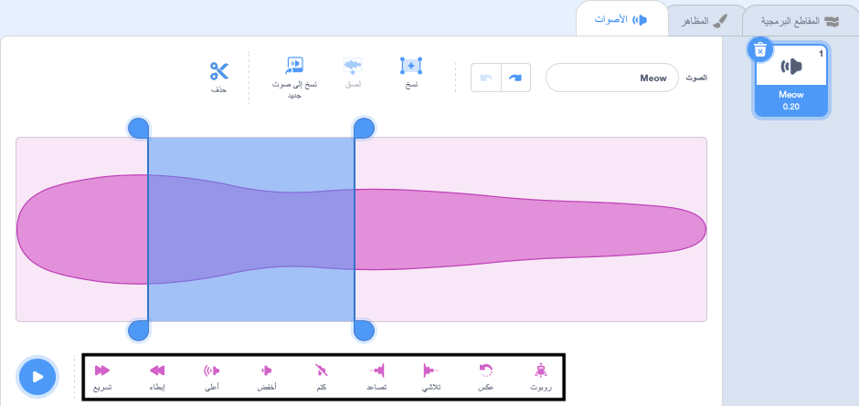

يحتوي محرر الصوت على أدوات لتغيير سرعة الصوت وحجمه وتلاشي تأثيرات الصوت - يمكنك أيضًا جعله صوت روبوت!

لتطبيق تأثير على الصوت بالكامل ، انقر فوق أداة المؤثرات الصوتية الموجودة أسفل الموجة الصوتية:

انقر فوق أدوات المؤثرات الصوتية عدة مرات كما تريد في كل مرة سيتم تطبيق التأثير مرة أخرى.

To apply an effect to part of a sound, choose a starting position for your effect on the sound wave then left-click and hold.

Drag your mouse pointer to the effect end position and release. You will see a highlighted area on the sound wave.

If you are using a tablet using your mouse or finger to tap and drag over the sound wave.

Click on a sound effect tool. The sound wave will update and you can play your new sound:

