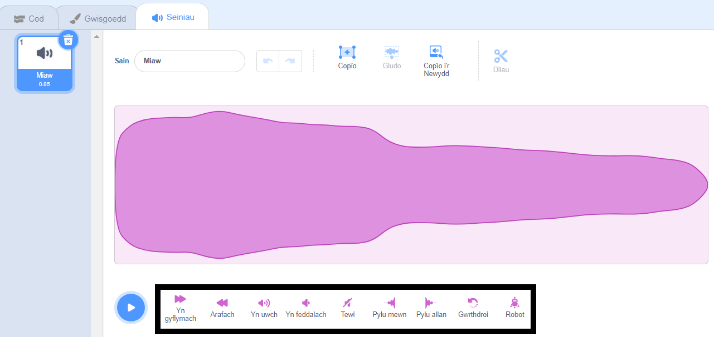
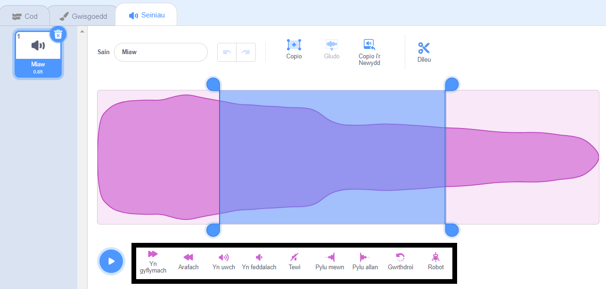

Ar y golygydd sain, galli di newid cyflymder y sŵn, lefel y sain ac effeithiau tewi - galli di hefyd ei wneud yn robotaidd!

I ddefnyddio effaith ar sain cyfan, clicia ar yr offer effaith sain o dan y donfedd sain:

Clicia ar yr offer effeithiau sain cymaint o weithiau ag wyt ti'n dymuno oherwydd bydd yn defnyddio'r effaith eto bob tro.

I osod effaith ar ran o sain, dewisa'r safle cychwyn ar gyfer dy effaith ar y donfedd sain wedyn clicia'r botwm chwith a'i ddal.

Llusga bwyntydd y llygoden i safle gorffen yr effaith ac yna gollwng y botwm. Bydd ardal o'r donfedd sain wedi'i hamlygu.

Os wyt ti'n defnyddio tabled, defnyddia'r llygoden neu fys i dapio a llusgo dros y donfedd sain.

Clicia ar offeryn effaith sain. Bydd y donfedd sain yn diweddaru a byddi di'n gallu chwarae'r sain newydd:

