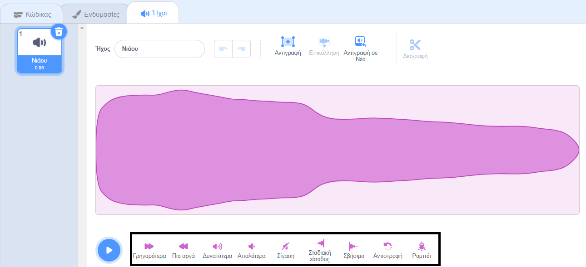

Το πρόγραμμα επεξεργασίας ήχου διαθέτει εργαλεία για να αλλάξεις την ταχύτητα, την ένταση και τα εφέ εξασθένισης ενός ήχου - μπορείς επίσης να τον κάνεις ρομποτικό!

Για να εφαρμόσεις ένα εφέ σε ολόκληρη τη διάρκεια του ήχου, κάνε κλικ σε ένα εργαλείο ηχητικού εφέ κάτω από το ηχητικό κύμα:

Κάνε κλικ στα εργαλεία εφέ ήχου όσες φορές θέλεις, καθώς κάθε φορά εφαρμόζεις ξανά το εφέ.

Για να εφαρμόσεις ένα εφέ σε μέρος ενός ήχου, επίλεξε μια αρχική θέση για το εφέ σου στο ηχητικό κύμα και, στη συνέχεια, κάνε αριστερό κλικ και κράτησέ το πατημένο.

Σύρε το δείκτη του ποντικιού σου στην τελική θέση για το εφέ του ήχου σου και άφησέ το. Θα δεις μια περιοχή που έχει επισημανθεί στο ηχητικό κύμα.

Εάν χρησιμοποιείς tablet χρησιμοποίησε το ποντίκι ή το δάχτυλό σου για να αγγίξεις και να σύρεις πάνω στο ηχητικό κύμα.

Κάνε κλικ σε ένα εργαλείο εφέ ήχου. Το ηχητικό κύμα θα ενημερωθεί και μπορείς να αναπαράγεις τον νέο σου ήχο:

