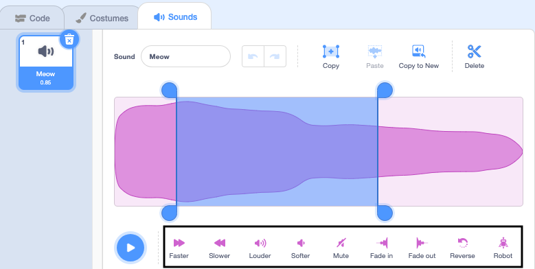

The sound editor has tools to change the speed, volume and fade effects of a sound - you can also make it robotic!

To apply an effect to the whole sound click on a sound effect tool below the sound wave: 

Use the play button to play the new sound. Click on the sound effect tools as many times as you like as each time it will apply the effect again.

To apply an effect to part of a sound, choose a starting position for your effect on the sound wave then left-click and hold. Drag your mouse pointer to the effect end position and release. You will see a highlighted area on the sound wave.  

If you are using a tablet using your mouse or finger to tap and drag over the sound wave.

Click on a sound effect tool. The sound wave will update and you can play your new sound:

