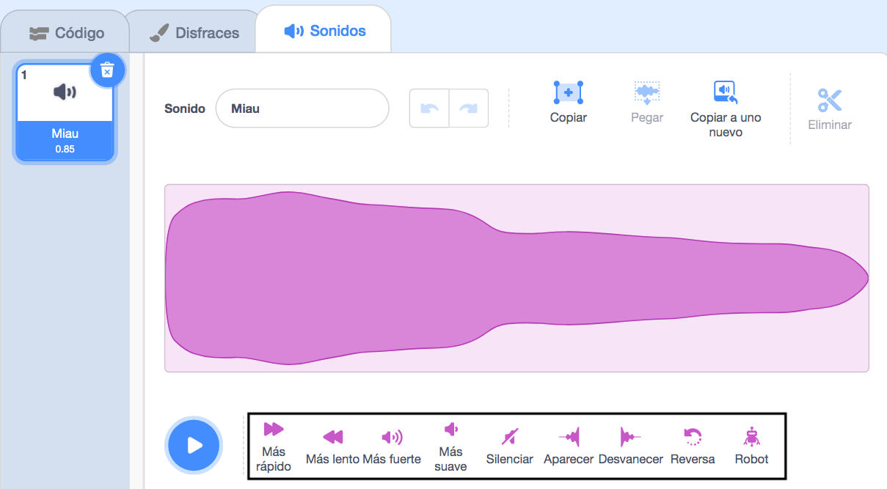
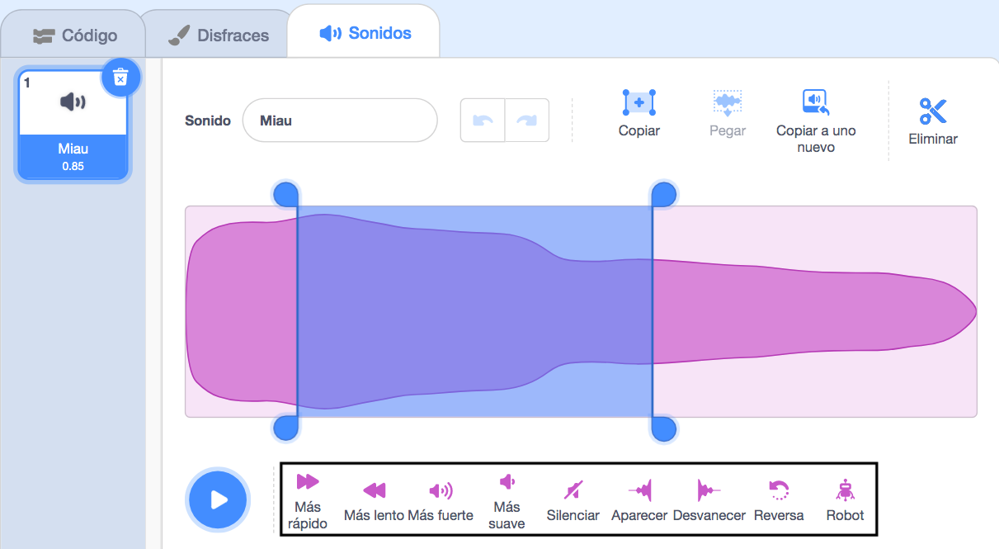

El Editor de sonidos tiene herramientas para cambiar la velocidad, el volumen y los efectos de desvanecimiento de un sonido; ¡también puedes hacerlo robótico!

Para aplicar un efecto a todo el sonido, haz clic en una de las herramientas de efectos de sonido debajo de la onda de sonido:

Haz clic en las herramientas de efectos de sonido tantas veces como quieras, ya que cada vez que lo hagas se aplicará el efecto nuevamente.

Para aplicar un efecto a una parte del sonido, elige una posición inicial para tu efecto en la onda de sonido, luego haz clic izquierdo y mantén presionado.

Arrastra el puntero del ratón hasta la posición final del efecto y suéltalo. Verás un área resaltada en la onda de sonido.

Si estás usando una tableta, usa el dedo para tocar y arrastrar sobre la onda de sonido.

Haz clic en una herramienta de efectos de sonido. La onda de sonido se actualizará y podrás reproducir tu nuevo sonido:

