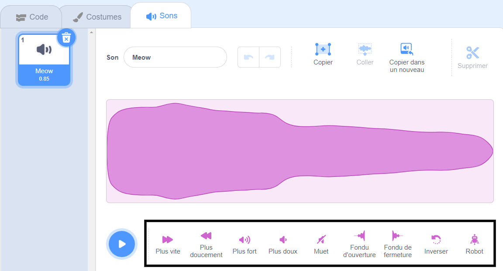
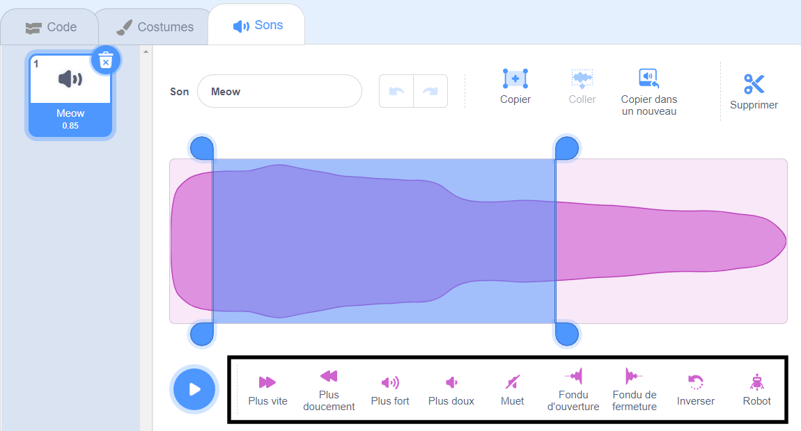

L'éditeur de sons dispose d'outils pour modifier la vitesse, le volume et les effets de fondu d'un son - tu peux également le rendre robotique !

Pour appliquer un effet à l'ensemble du son, clique sur un outil d'effet sonore sous l'onde sonore :

Clique sur les outils d'effets sonores autant de fois que tu le souhaites car à chaque fois, l'effet sera réappliqué.

Pour appliquer un effet à une partie d'un son, choisis une position de départ pour ton effet sur l'onde sonore, puis clique et maintiens enfoncé.

Fais glisser le pointeur de ta souris jusqu'à la position finale de l'effet et relâche. Tu verras une zone en surbrillance sur l'onde sonore.

Si tu utilises une tablette, utilise ta souris ou ton doigt pour appuyer et faire glisser sur l'onde sonore.

Clique sur un outil d'effets sonores. L'onde sonore se mettra à jour et tu pourras jouer ton nouveau son :

