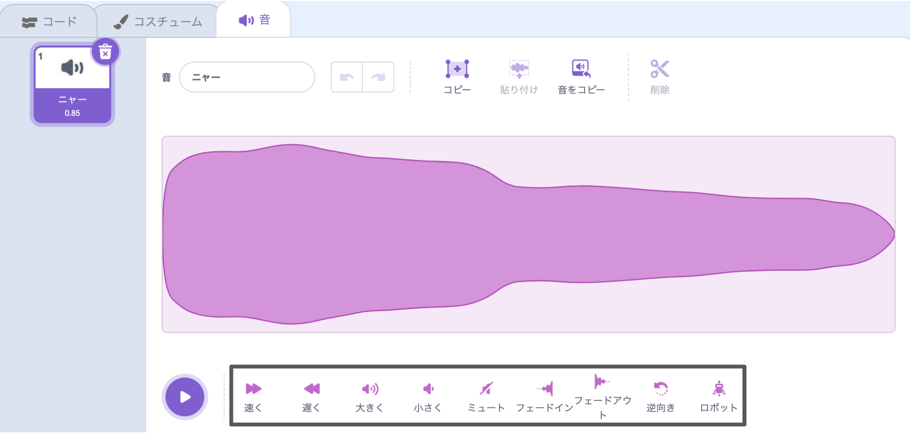
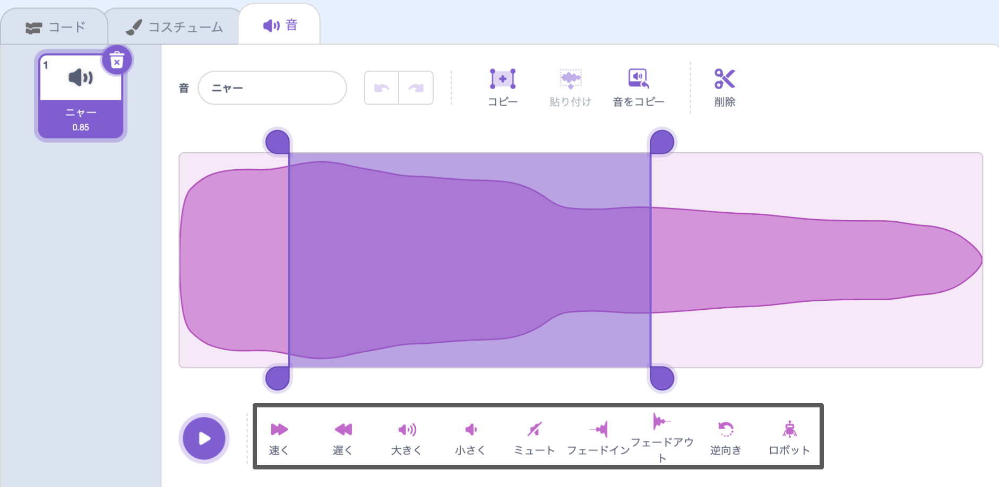

サウンドエディターには、音の速度、音量、フェード効果を変更したり、ロボットのようにもできるツールがあります。

音全体に効果を適用するには、音波の下にある音響効果ツールをクリックします。

音響効果ツールをクリックするたびに効果が再度適用されます。

音の一部に効果を適用するには、音波上で効果を開始する位置を選択し、左クリックしてそのまま押し続けます。

マウスポインターを効果の終了位置までドラッグして放します。 音波上で領域がハイライトされます。

タブレットを使用している場合は、マウスまたは指を使って音波上をタップしドラッグします。

音響効果ツールをクリックします。 音波が更新され、新しい音を再生できるようになります。

