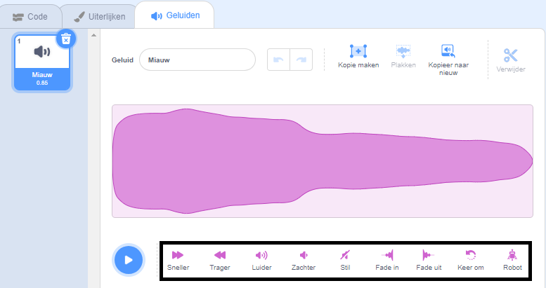

De geluidseditor heeft gereedschap om de snelheid, het volume en de fade-effecten van een geluid te veranderen - je kunt het ook robot-achtig maken!

Om een effect op het hele geluid toe te passen, klik je op een geluidseffect gereedschap onder de geluidsgolf:

Klik zo vaak als je wilt op de hulpmiddelen voor geluidseffecten, want elke keer wordt het effect opnieuw toegepast.

Om een effect toe te passen op een deel van een geluid, kies je een startpositie voor je effect op de geluidsgolf en houdt je vervolgens de linkermuisknop ingedrukt.

Sleep je muisaanwijzer naar de eindpositie van het effect en laat los. Je ziet een gemarkeerd gebied op de geluidsgolf.

Als je een tablet gebruikt, gebruik je je muis of vinger om op de geluidsgolf te tikken en te slepen.

Klik op een geluidseffect gereedschap. De geluidsgolf wordt bijgewerkt en je kunt je nieuwe geluid afspelen:

