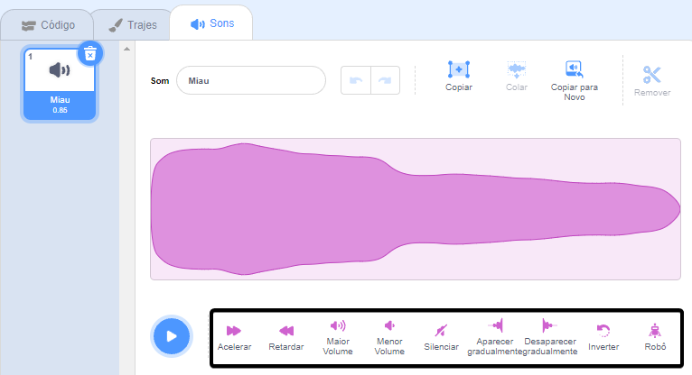
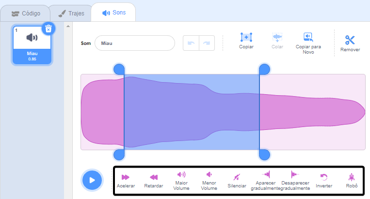

O editor de som possui ferramentas para alterar a velocidade, o volume e os efeitos de fade de um som — você também pode torná-lo robótico!

Para aplicar um efeito ao som todo, clique em uma ferramenta de efeito sonoro abaixo da onda sonora:

Clique nas ferramentas de efeitos sonoros quantas vezes quiser, pois, a cada vez o efeito será aplicado novamente.

Para aplicar um efeito a uma parte do som, selecione o pedaço da onda desejado, clicando com o botão esquerdo onde gostaria de iniciar a seleção e segure.

Arraste o ponteiro do mouse para uma nova posição final desejada e solte. Você verá uma área destacada na onda sonora.

Se você estiver usando um tablet, use o mouse ou o dedo para tocar e arrastar sobre a onda sonora.

Clique em uma ferramenta de efeito sonoro. A onda sonora será atualizada e você poderá reproduzir seu novo som:

