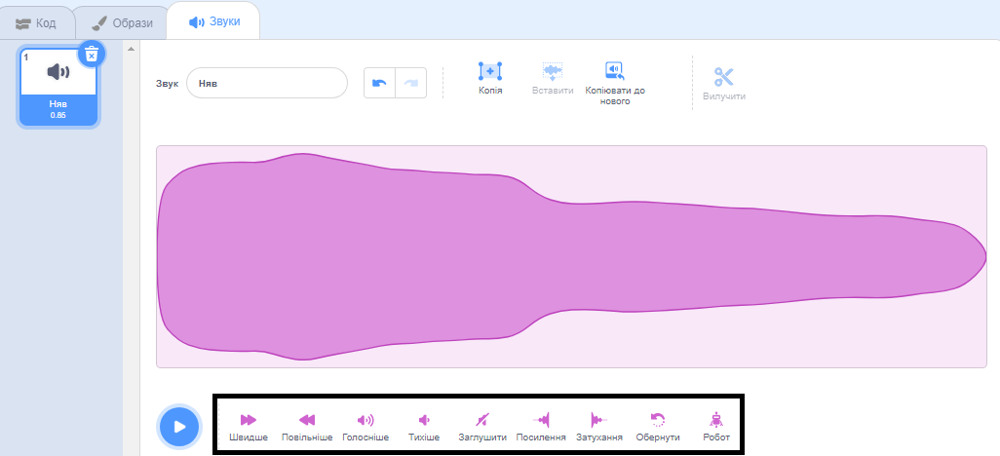
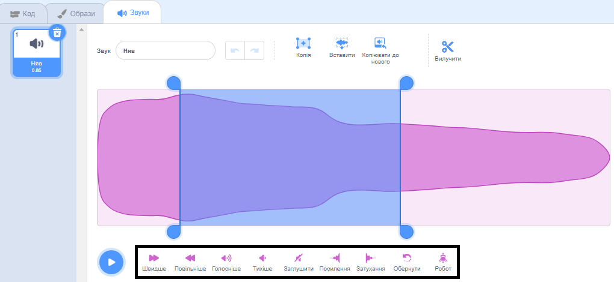

У звуковому редакторі є інструменти для зміни швидкості, гучності та ефекту згасання звуку. Також ти можеш зробити його роботизованим!

Щоб застосувати ефект до всієї звукової доріжки, натисни кнопку звукового ефекту, який знаходиться під звуковою хвилею:

Натискай на кнопки зміни звукових ефектів стільки разів, скільки хочеш, і кожного разу ефект буде діяти повторно.

Щоб застосувати ефект до частини звукової доріжки, вибери початкову позицію на звуковій хвилі, а потім клацни лівою кнопкою миші й утримуй її.

Перетягни курсор миші до кінцевої позиції ефекту і відпусти. Ти побачиш на звуковій хвилі виділену ділянку.

Якщо ти використовуєш планшет, торкнись звукової хвилі за допомогою миші або пальця і перетягни її.

Натисни кнопку звукового ефекту. Звукова хвиля оновиться, і ти зможеш відтворити свій новий звук:

